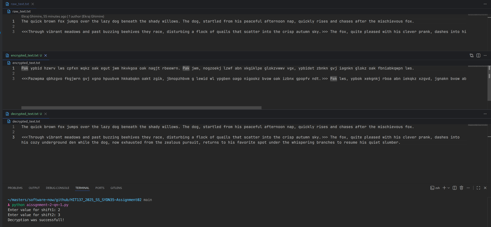
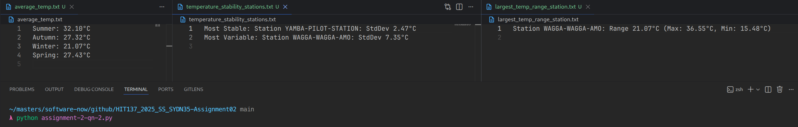

# HIT137_2025_SS_SYDN35-Assignment02
Software Now - Assignment 2

## Team Collaboration Rate in %
| Name               | Student ID |  Collaboration Rate in %  |
|--------------------|------------|---------------------------|
| Ekraj Ghimire      | S398831    |                       25% |
| Sudip Sunar        | S398629    |                       25% |
| Roshan Lamichhane  | S399178    |                       25% |
| Shrijan Neupane    | S398335    |                       25% |
---
## Overview
This repository contains the assignment task for HIT137 Group Assignment 02.  
The assignment focuses on file handling, encryption/decryption, data analysis, recursion, and visualization using Python.  
All tasks were developed collaboratively and tracked using GitHub as per the assignment requirements.  

## Question 1 
Create a program that reads the text file "raw_text.txt", encrypts its contents using a simple encryption method, and writes the encrypted text to a new file "encrypted_text.txt". Then create a function to decrypt the content and a function to verify the decryption was successful. 
*Requirements* 
The encryption should take two user inputs (shift1, shift2), and follow these rules: 
  • For lowercase letters: 
    o If the letter is in the first half of the alphabet (a-m): shift forward by shift1 * shift2 positions 
    o If the letter is in the second half (n-z): shift backward by shift1 + shift2 positions 
  • For uppercase letters: 
    o If the letter is in the first half (A-M): shift backward by shift1 positions 
    o If the letter is in the second half (N-Z): shift forward by shift2² positions (shift2 squared) 
  • Other characters: 
    o Spaces, tabs, newlines, special characters, and numbers remain unchanged 
*Main Functions to Implement* 
**Encryption function:** Reads from "raw_text.txt" and writes encrypted content to "encrypted_text.txt". 
**Decryption function:** Reads from "encrypted_text.txt" and writes the decrypted content to "decrypted_text.txt". 
**Verification function:** Compares "raw_text.txt" with "decrypted_text.txt" and prints whether the decryption was successful or not. 
*Program Behavior* 
When run, your program should automatically: 
  1. Prompt the user for shift1 and shift2 values 
  2. Encrypt the contents of "raw_text.txt" 
  3. Decrypt the encrypted file 
  4. Verify the decryption matches the original 

  Solution:
  

---
## Question 2
Create a program that analyses temperature data collected from multiple weather stations in Australia. The data is stored in multiple CSV files under a "temperatures" folder, with each file representing data from one year. Process ALL .csv files in the temperatures folder. Ignore missing temperature values (NaN) in calculations.

**Main Functions to Implement:**

**Seasonal Average:** Calculate the average temperature for each season across ALL stations and ALL years. Save the results to "average_temp.txt".  
  - Use Australian seasons: Summer (Dec-Feb), Autumn (Mar-May), Winter (Jun-Aug), Spring (Sep-Nov)  
  - Output format example: "Summer: 28.5°C"  

**Temperature Range:** Find the station(s) with the largest temperature range (difference between the highest and lowest temperature ever recorded at that station). Save the results to "largest_temp_range_station.txt".  
  - Output format example: "Station ABC: Range 45.2°C (Max: 48.3°C, Min: 3.1°C)"  
  - If multiple stations tie, list all of them  

**Temperature Stability:** Find which station(s) have the most stable temperatures (smallest standard deviation) and which have the most variable temperatures (largest standard deviation). Save the results to "temperature_stability_stations.txt".  
  - Output format example:  
    - "Most Stable: Station XYZ: StdDev 2.3°C"  
    - "Most Variable: Station DEF: StdDev 12.8°C"  
  - If multiple stations tie, list all of them
  Solution:
  

---

## Question 3
Create a program that uses a recursive function to generate a geometric pattern using Python's turtle graphics. The pattern starts with a regular polygon and recursively modifies each edge to create intricate designs.

**Pattern Generation Rules:**  
For each edge of the shape:  
1. Divide the edge into three equal segments  
2. Replace the middle segment with two sides of an equilateral triangle pointing inward (creating an indentation)  
3. This transforms one straight edge into four smaller edges, each 1/3 the length of the original edge  
4. Apply this same process recursively to each of the four new edges based on the specified depth  

**Visual Example:**  
- **Depth 0**: Draw a straight line (no modification) 

- **Depth 1**: Line becomes: ——\⁄—— (indentation pointing inward) 

   
 
- **Depth 2**: Each of the 4 segments from depth 1 gets its own indentation  

**User Input Parameters:**  
The program should prompt the user for:  
- **Number of sides**: Determines the starting shape  
- **Side length**: The length of each edge of the initial polygon in pixels  
- **Recursion depth**: How many times to apply the pattern rules  

**Example Execution:**  
Enter the number of sides: 4 
Enter the side length: 300 
Enter the recursion depth: 3 

